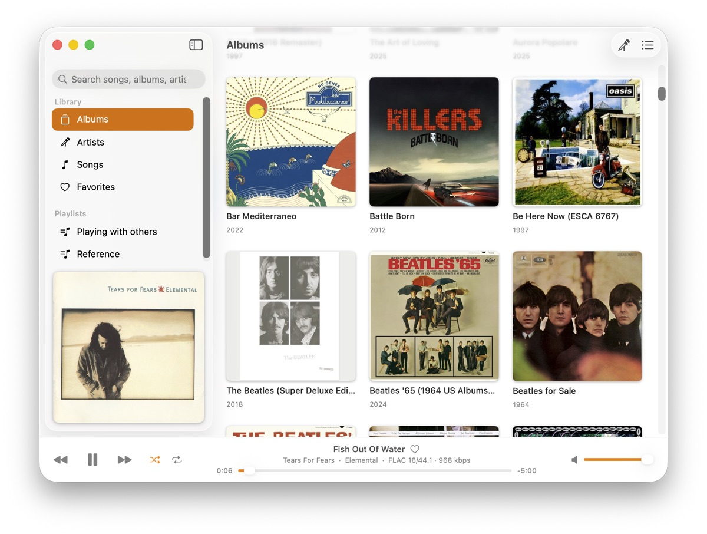
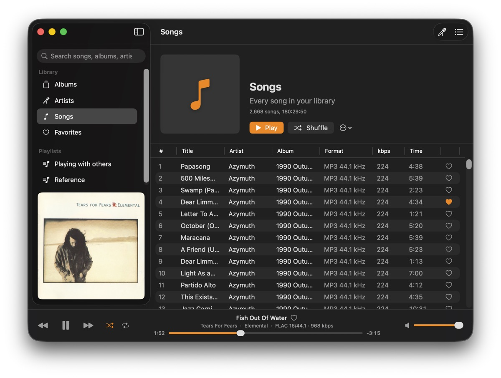
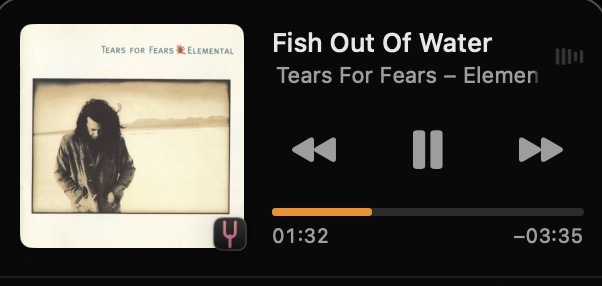

# Diapason

Diapason is a native macOS music player for a [Jellyfin](https://jellyfin.org) server. Its playback controls work with macOS Now Playing: Control Center, the media keys, and AirPods.







## Features

**Library**

- Browse albums, artists, songs, and playlists, with artwork.
- Songs shows the full library. Play or Shuffle on this page plays all the songs.
- Search the full library from the sidebar.
- Mark songs as favorites with the heart, then open them from Favorites in the sidebar.
- Use Go to Album and Go to Artist from the context menu of a song, from the player bar, or from the Controls menu.

**Playback**

- Play, pause, next, previous, seek, and volume. Double-click a track to start playback from that track.
- Shuffle and repeat (off, all, one). Diapason keeps these settings after a restart.
- Up Next queue (Cmd+Shift+U): Play Next, Add to Queue, drag to reorder, Delete to remove, and Clear.
- Synced lyrics (Cmd+Shift+L). Click a line to go to that position in the song.
- The track list and the player bar show the format: codec, bit depth, sample rate, and bit rate.
- Large artwork: hover over the cover in the player bar, then click the chevron.

**macOS and server**

- Now Playing integration: Control Center, media keys, and the position scrubber.
- Diapason reports playback to the server, so play counts and history stay correct.
- Automatic updates with Sparkle.

FLAC, MP3, AAC, ALAC, WAV, and AIFF play directly. For other formats, the server transcodes the audio to AAC.

## Install

Download the DMG from the [latest release](https://github.com/indiependente/diapason/releases/latest). The DMG is not notarized. The release notes tell you how to clear the quarantine flag.

## Build from source

You need macOS 26 or later, Xcode 26 or later, and these Homebrew tools:

```sh
brew install xcodegen xcbeautify swiftlint swiftformat
make run
```

The `.xcodeproj` file is generated and is not in git. To change the project, edit `project.yml`, then run `make gen`.

| Command | What it does |
|---|---|
| `make gen` | Generates `Diapason.xcodeproj` from `project.yml` |
| `make build` | Builds the app |
| `make run` | Builds and starts `Diapason.app` |
| `make test` | Runs the unit tests |
| `make test-e2e` | Runs the end-to-end tests against a real server |
| `make lint` | Runs SwiftLint with `--strict` |
| `make format` | Runs SwiftFormat in place |
| `make icons` | Generates the icon set from `Resources/AppIcon.png` |
| `make install` | Copies the app to `/Applications/` |
| `make archive` | Archives the app to `build/Diapason.xcarchive` |
| `make dmg` | Builds a DMG signed with Developer ID |
| `make dmg-unsigned` | Builds a DMG with an ad-hoc signature, for personal use |
| `make appcast` | Signs the DMG and writes `build/appcast.xml` for Sparkle |
| `make release` | Runs `dmg`, then `appcast` |
| `make clean` | Removes the generated project and the build output |

### Credentials

Diapason stores the session token in `~/Library/Application Support/Diapason/credentials.json`, with owner-only permissions. It does not use the Keychain. Each development build gets a new ad-hoc signature, and the Keychain then asks for permission at each start.

### End-to-end tests

`make test-e2e` runs the real app against a Jellyfin server. Each feature has its own test.

1. Copy the example file: `cp .env.example .env`.
2. In `.env`, set the URL of a server that you can reach, a user, and the password of that user. Do not use quotes.
3. Run `make test-e2e`.

The Makefile reads `.env`. Git ignores `.env`, so your password stays on your computer.

- To run one test, add `ONLY=PlaybackUITests/testSearch`.
- If the variables are not set, the tests are skipped.
- The tests start the app with `-DiapasonFreshSession`. This flag keeps the session in memory, so your stored sign-in does not change.

## Releases

To publish a release, push a version tag:

```sh
git tag v0.2.0
git push origin v0.2.0
```

The Release workflow runs the unit tests and builds `Diapason-<version>.dmg`. Then it publishes a GitHub release with the DMG attached.

Sparkle reads `appcast.xml` from the latest GitHub release. To set up Sparkle, do these steps one time:

1. Install the Sparkle tools: `brew install --cask sparkle`.
2. Run `generate_keys`. This command stores the private key in your login Keychain and shows the public key.
3. Put the public key in `SUPublicEDKey` in `project.yml`, then commit the change. Until you do this step, "Check for Updates…" is disabled.
4. Run `generate_keys -x sparkle-key.txt`. Save the content of the file as the `SPARKLE_ED_PRIVATE_KEY` repository secret, then delete the file. Without this secret, releases have no `appcast.xml`.

The project has no Developer ID certificate, so the release DMG has an ad-hoc signature. When you set up a certificate and a team, `make dmg` builds a DMG signed with Developer ID.

## Project layout

```
Sources/Diapason/
  Jellyfin/   REST client, credentials, SecretStore, Library (server state)
  Player/     PlayQueue, Player (AVPlayer), NowPlaying (MediaPlayer bridge), RepeatMode
  Updates/    UpdaterController (Sparkle)
  Models/     Track and MediaInfo, MusicCollection, Artist, LyricLine, SidebarItem, Navigation
  Views/      RootView, SidebarView, AlbumsView, ArtistsView, SearchView, TrackListView, QueueView, LyricsView, NowPlayingArtwork, PlayerBar, SignInView, SettingsView
Tests/DiapasonTests/     unit tests (Swift Testing, ViewInspector)
Tests/DiapasonUITests/   XCUITest end-to-end tests
```
